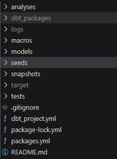

# Data transformation with dbt 
## Overview

This repository contains a dbt (data build tool) project that transforms raw data from the `seed` folder into a structured format for analysis. The project utilizes dbt to manage transformations, testing, and documentation. The initial setup was based on the Jaffle Shop GitHub repository, and BigQuery was used as the data warehouse.

## Project Structure



## Getting Started

### Prerequisites

- dbt installed locally
- Access to the raw data source
- Google Cloud Platform account with BigQuery enabled

### Setup

1. Cloned the Jaffle Shop GitHub repository for data:

   ```bash
   git clone https://github.com/jaffle_shop.git
   ```

2. Project repository was also cloned:

   ```bash
   git clone https://github.com/StanleyBankesie/Data-transformation-with-dbt.git
   ```

3. Then moved to the project directory:

   ```bash
   cd Data-transformation-with-dbt 
   ```

4. Installed dbt packages and dependencies:

   ```bash
   dbt deps
   ```

5. `profiles.yml` was configured with the connection details for BigQuery:

```yml
data_transformation:
  outputs:
    dev:
      dataset: schema
      job_execution_timeout_seconds: 300
      job_retries: 1
      keyfile: XXXXXXXXXXX
      location: US
      method: service-account
      priority: interactive
      project: dbtbigquery-4321
      threads: 4
      type: bigquery
  target: dev
```
6. dbt command was run to compile the project:

   ```bash
   dbt compile
   ```

## Development Workflow in transforming data with dbt

1. **Data Seeding**: Retrieve the dataset from the `seed` folder.
2. **Modeling**: Define transformation logic in `models/`.
3. **Testing**: Write tests in `tests/` to validate model outputs.
4. **Documentation**: Document models and transformations inline and in `README.md`.
5. **Deployment**: Use dbt to deploy transformations to the BigQuery data warehouse.

